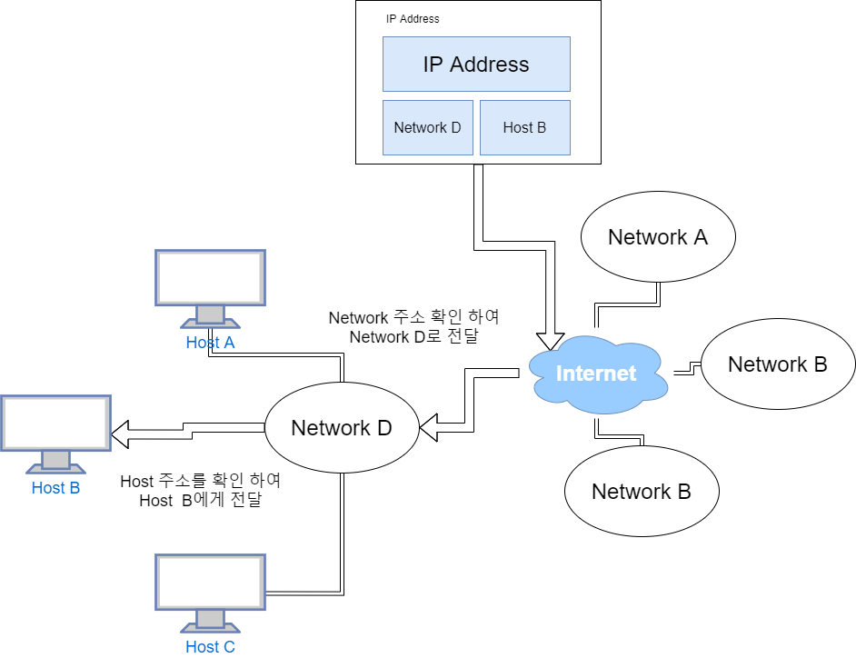
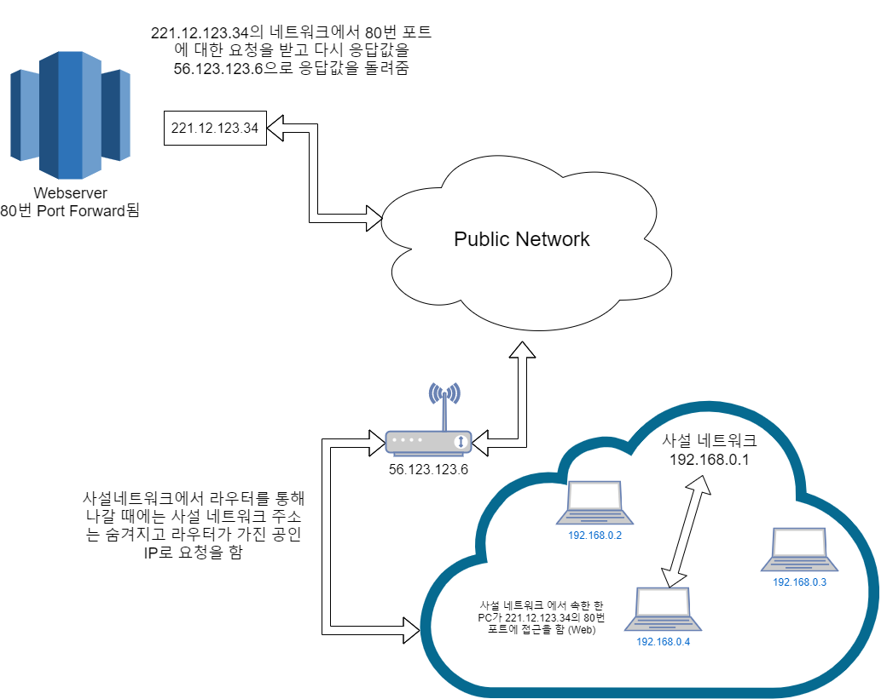
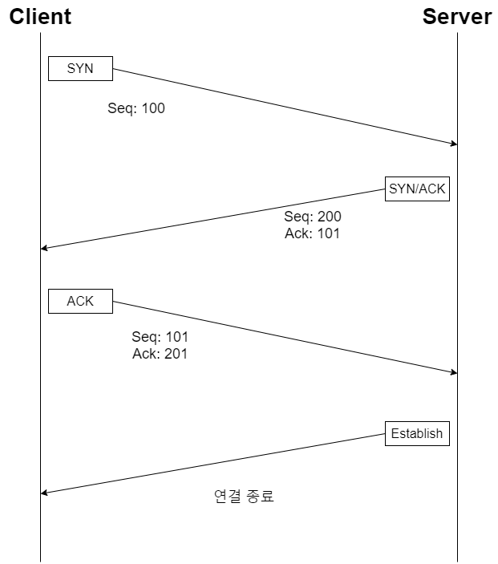

# Netwhat

> "This project is an introduction to network problematics"
>
> #### 📝 PDF
>
> - [**`FILE LINK`**](../pdf/en.subject-Netwhat.pdf)

## 🚀 Content

### 🚩 Mandatory part

#### What is an IP address

IP 주소는 인터넷에 연결된 기기를 식별하는 유일한 식별자 이며 현재 [`IPv4`](#IPv4)와 [`IPv6`](#IPv6)를 사용하고 있다.

##### IPv4

현재 일반적으로 사용되는 IP 주소 이다.

이 주소의 범위는 **32bit**로 **8bit**씩 표기를 하여 8자리로 나타내며 **0.0.0.0 ~ 255.255.255.255** 이다.

이론적으로 42억9496만7296개의 IP가 존재한다.

단 중간의 일부 IP 주소는 특별한 용도를 위해 예약 되어 있으며 예를 들어 127.0.0.1은 자기 자신을 가르키는 주소(localhost)이다.

##### IPv6

시간이 지남에 따라 IP부족 현상을 해결하기 위해 만든 새로운 버전이다.

기존 32bit의 주소에서 **128bit**로 확장된 것이 특징이다.

주소의 표현은 **16bit**씩 표기를 하여 8자리로 나타낸다.

> ex) 2001:0db8:85a3:08d3:1319:8a2e:0370:7334

그러나 대부분의 자리가 0의 숫자를 갖게 되므로, 0000을 하나의 0으로 축약하거나, 혹은 아예 연속되는 0의 그룹을 없애고 ':' 만을 남길 수 있다. 따라서 아래의 IPv6 주소들은 모두 같은 주소를 나타낸다.

```
2001:0DB8:0000:0000:0000:0000:1428:57ab
2001:0DB8:0000:0000:0000::1428:57ab
2001:0DB8:0:0:0:0:1428:57ab
2001:0DB8:0::0:1428:57ab
2001:0DB8::1428:57ab
```

이론적으로 2128개인 약 3.4x1038개(340,282,366,920,938,463,463,374,607,431,768,211,456개)의 주소가 존재하여 거의 무한하게 사용이 가능하다.

##### Network Addres, Host Address


기본적으로 IP Address는 Network Address와 Host Address로 구분이 되어 있다.



 이때 인터넷에서 IP Address로 전달을 요청을 하게 되면 위와 같이 먼저 Network Address를 확인하여 해당하는 네트워크에 전달을 한다. 그 후 전달 받은 Network에서 Host Address를 확인하여 전달을 하게 되는 구조로 이루어져 있다.

#### What is a Netmask

Netmask는 Network Address 부분을 1bit로 치환한 것이 Netmask이다.

**IP**와 **Netmask**를 `and` 연산을 하면 **Network address**를 알 수 있다. 

> ex)
>
> **IP**: 198.168.0.123
>
> **Network address**: 192.168.0
>
> **Host address**: 123
>
> **Netmask**: 255.255.255.0

#### What is a class of IP addresses

Class는 A, B, C, D, E Class로 구성되어 있다.

|                            Class                             | Leading bits | Size of *network number* bit field | Size of *rest* bit field | Number of networks | Addresses per network | Total addresses in class | Start address |                         End address                          | Default [subnet mask](https://en.wikipedia.org/wiki/Subnet_mask) in [dot-decimal notation](https://en.wikipedia.org/wiki/Dot-decimal_notation) | [CIDR notation](https://en.wikipedia.org/wiki/CIDR_notation) |
| :----------------------------------------------------------: | :----------: | :--------------------------------: | :----------------------: | :----------------: | :-------------------: | :----------------------: | :-----------: | :----------------------------------------------------------: | :----------------------------------------------------------: | :----------------------------------------------------------: |
|                           Class A                            |      0       |                 8                  |            24            |      128 (27)      |   16,777,216 (224)    |   2,147,483,648 (231)    |   *0.0.0.0*   | *127.255.255.255*[[a\]](https://en.wikipedia.org/wiki/Classful_network#cite_note-5) |                         *255.0.0.0*                          |                             */8*                             |
|                           Class B                            |      10      |                 16                 |            16            |    16,384 (214)    |     65,536 (216)      |   1,073,741,824 (230)    |  *128.0.0.0*  |                      *191.255.255.255*                       |                        *255.255.0.0*                         |                            */16*                             |
|                           Class C                            |     110      |                 24                 |            8             |  2,097,152 (221)   |       256 (28)        |    536,870,912 (229)     |  *192.0.0.0*  |                      *223.255.255.255*                       |                       *255.255.255.0*                        |                            */24*                             |
| Class D ([multicast](https://en.wikipedia.org/wiki/Multicast)) |     1110     |            not defined             |       not defined        |    not defined     |      not defined      |    268,435,456 (228)     |  *224.0.0.0*  |                      *239.255.255.255*                       |                         not defined                          |                         not defined                          |
|                      Class E (reserved)                      |     1111     |            not defined             |       not defined        |    not defined     |      not defined      |    268,435,456 (228)     |  *240.0.0.0*  | *255.255.255.255*[[b\]](https://en.wikipedia.org/wiki/Classful_network#cite_note-6) |                         not defined                          |                         not defined                          |

이때 D, E Class는 특수 목적으로 할당되어 있으며, 각 Class에서 사용 가능한 Network수는 위 표에 표기 된 것 보다 적을 수 있다. (특수 목적으로 예약되어 있는 경우)

##### 특수범위

|              주소               |  해당 사이더   |                             목적                             |                       RFC                       | 클래스 | 전체 주소 개수 |
| :-----------------------------: | :------------: | :----------------------------------------------------------: | :---------------------------------------------: | :----: | :------------: |
|   `  0.0.0.0 - 0.255.255.255`   |   0.0.0.0/8    |                          Zero 주소                           | [RFC 1700](https://tools.ietf.org/html/rfc1700) |   A    |   16,777,216   |
|  `  10.0.0.0 - 10.255.255.255`  |   10.0.0.0/8   |        [사설망](https://ko.wikipedia.org/wiki/사설망)        | [RFC 1918](https://tools.ietf.org/html/rfc1918) |   A    |   16,777,216   |
| ` 127.0.0.0 - 127.255.255.255`  |  127.0.0.0/8   |                   로컬호스트 Loopback 주소                   | [RFC 1700](https://tools.ietf.org/html/rfc1700) |   A    |   16,777,216   |
| `169.254.0.0 - 169.254.255.255` | 169.254.0.0/16 |      [Zeroconf](https://ko.wikipedia.org/wiki/Zeroconf)      | [RFC 3330](https://tools.ietf.org/html/rfc3330) |   B    |     65,536     |
| ` 172.16.0.0 - 172.31.255.255`  | 172.16.0.0/12  |        [사설망](https://ko.wikipedia.org/wiki/사설망)        | [RFC 1918](https://tools.ietf.org/html/rfc1918) |   B    |   1,048,576    |
|   ` 192.0.2.0 - 192.0.2.255`    |  192.0.2.0/24  |                         문서와 예제                          | [RFC 3330](https://tools.ietf.org/html/rfc3330) |   C    |      256       |
|  `192.88.99.0 - 192.88.99.255`  | 192.88.99.0/24 | [IPv6](https://ko.wikipedia.org/wiki/IPv6)에서 [IPv4](https://ko.wikipedia.org/wiki/IPv4)로의 애니캐스트 릴레이 | [RFC 3068](https://tools.ietf.org/html/rfc3068) |   C    |      256       |
| `192.168.0.0 - 192.168.255.255` | 192.168.0.0/16 |        [사설망](https://ko.wikipedia.org/wiki/사설망)        | [RFC 1918](https://tools.ietf.org/html/rfc1918) |   C    |     65,536     |
| ` 198.18.0.0 - 198.19.255.255`  | 198.18.0.0/15  |                    네트워크 장치 벤치마크                    | [RFC 2544](https://tools.ietf.org/html/rfc2544) |   C    |    131,072     |
| ` 224.0.0.0 - 239.255.255.255`  |  224.0.0.0/4   |    [멀티캐스트](https://ko.wikipedia.org/wiki/멀티캐스트)    | [RFC 3171](https://tools.ietf.org/html/rfc3171) |   D    |  268,435,456   |
| ` 240.0.0.0 - 255.255.255.255`  |  240.0.0.0/4   |                            예약됨                            | [RFC 1700](https://tools.ietf.org/html/rfc1700) |   E    |  268,435,456   |

현재는 IP의 급격한 고갈로 인해 효율적인 IP 배정을 위해 `CIDR`로 변경되었다. 

#### What is the subnet of an IP with Netmask

Netmask는 위에서 설명한 Class 개념을 통해 Network를 할당하는 것에서 더욱 세분화하여 할당을 가능하게 한 기술이다.

기본적으로 submask는 Class 개념에서 할당 받는 것을 Default Mask 지칭하고 이제 더욱 세분화하여 사용을 할 때에는 아래와 같이 Subnet를 구분하여 사용하게 된다.

예시를 들어서 아래와 같이 Subnet mask를 사용할 수 있다.

| 접두사 크기 |  네트워크 마스크  | 이용 가능한 부분망 | 부분망 당 이용 가능한 호스트 수 | 사용 가능한 모든 호스트 수 |
| :---------: | :---------------: | :----------------: | :-----------------------------: | :------------------------: |
|     /24     |  `255.255.255.0`  |         1          |               254               |            254             |
|     /25     | `255.255.255.128` |         2          |               126               |            252             |
|     /26     | `255.255.255.192` |         4          |               62                |            248             |
|     /27     | `255.255.255.224` |         8          |               30                |            240             |
|     /28     | `255.255.255.240` |         16         |               14                |            224             |
|     /29     | `255.255.255.248` |         32         |                6                |            192             |
|     /30     | `255.255.255.252` |         64         |                2                |            128             |
|     /31     | `255.255.255.254` |        128         |               2 *               |            256             |

#### What is the broadcast address of a subnet

Broadcass Address는 네트워크에서 모든 Host Address에게 전달을 할 때 사용되는 Address이다. 

Subnet과 함께 사용되는 경우 broadcast주소를 구하는 방법은 Subnet과 xand 연산을 통해 알아낼 수 있다.

```
IP: 192.168.16.1/24
Submask: 255.255.255.0
Broadcast address: 192.1.68.16.255
```

#### What are the different ways to represent an ip address with the Netmask

Netmask를 표현 하는 방법은 2가지가 존재한다.

첫번째는 Netmask bit를 표현한 방법이다. 예를 들어 설명을 하자면 A Class의 경우 `255.0.0.0`이 된다.
두번째는 Netmask의 bit 갯수를 표현한 방법이다. 예를 들어 A class의 경우 `/8`로 표현한다.

이때 IP주소뒤에 붙여서 간결하게 사용한다. ex) 192.168.16.1/24

#### What are the differences between public and private IPs

Public IP와 Private IP는 기존 Public IP으로만 구성되었을 때의 IP 부족과 보안을 위해 만들어 졌다.

Public IP는 말 그대로 공개된 IP 주소이다. ICANN에서 발급되는 IP주소를 이야기 하며 이 주소를 통하여 인터넷이 사용이 가능하다.

Private IP는 특수범위 IP중 사설망에 해당된 범위를 사용한다. 



Private Network는 Public Network와 달리 외부에서 접근이 불가능 하다.

외부에서 내부로 접근을 하기위해서는 Public IP와 Port Forwarding이 필요하다.

Private Network에서 Public Network로 요청을 보내게 되면 사설네트워크와 연결된 라우터에서 Public IP로 요청이 보내지고 라우터는 이때 공인 IP로 들어온 응답값과 전송값을 전달해주는 역할을 하게 된다.

이러한 Private Network를 사용하게 되면 무분별하게 기기당 배정되는 IP를 낭비 하지 않을 수 있으며 Port가 Forwarding 되지 않는 이상 내부로 접근 할 수 힘들고 내부의 네트워크 구조를 모르기 때문에 보안에 강력해진다. 

#### What is TCP

TCP(Transmission Control Protocol)는 전송 프로토콜중 하나로 `3-Way-Handshake` 방식을 사용하여 신뢰도가 높은 점이 특징이다.

##### 3-Way-Handshake 



위와 같이 전송 후 제대로 받았는지에 대해 체크를 하기 때문에 문제가 발생하면 다시 재전송하여 신뢰도가 높은 연결을 보장할 수 있습니다.

단점은 UDP에 비해 전송후 확인하는 절차가 있어서 속도가 느립니다.

#### What is UDP

#### What are the network layers

#### What is the OSI model

#### What is a DHCP server and the DHCP protocol

#### What is a DNS server and the DNS protocol

#### What are the rules to make 2 devices communicate using IP addresses

#### How does routing work with IP

#### What is a default gateway for routing

#### What is a port from an IP point of view and what is it used for when connecting to another device